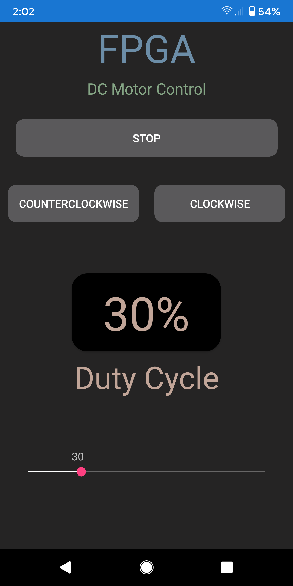

# DC Motor App

This is a custom Android app that connects to an FPGA through Bluetooth to control a DC motor.  The app consists of three buttons that stop the motor and change the direction from clockwise to counterclockwise.  A slider controls the motor's speed by adjusting the duty cycle from 10% to 100%.  

